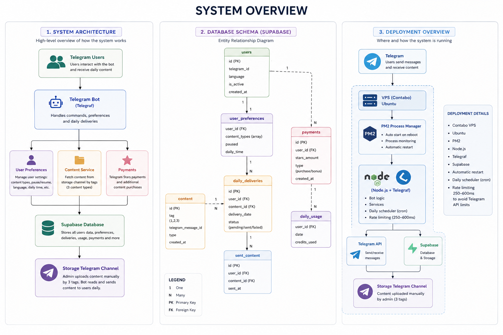
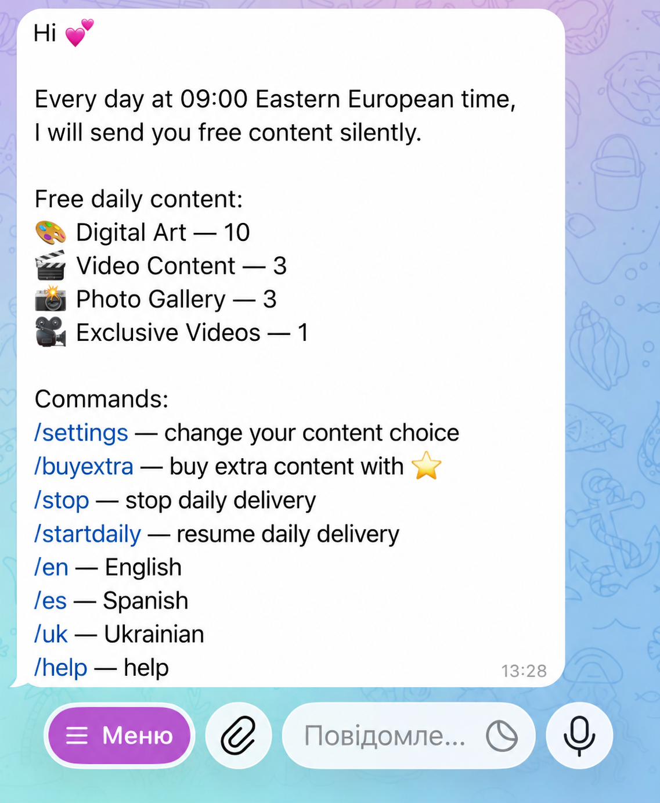
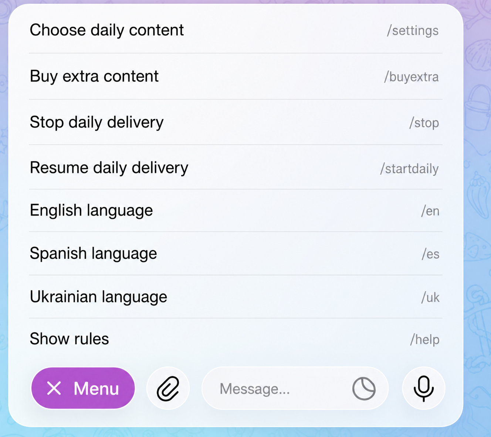

# Telegram Content Delivery Bot

> Production-ready Telegram bot built with **Node.js**, **TypeScript**, **Telegraf**, and **Supabase** for automated personalized content delivery.

The bot allows users to subscribe to different content categories, receive daily personalized updates, manage their preferences, and purchase additional content using Telegram Stars.

This repository serves as a technical showcase of the project's architecture and implementation. The production source code is private.

---

## ✨ Features

- 📬 Daily automated content delivery
- 🎯 Personalized content selection
- 📂 Multiple content categories
- ⏸ Pause / Resume delivery at any time
- 🌍 Multi-language interface
- ⭐ Premium content unlocked with Telegram Stars
- 💾 Persistent user preferences
- 🚦 Built-in request rate limiting (250–600 ms)
- ☁️ Production deployment on Contabo VPS

---

## 🏗 System Overview

<h2>📸 Screenshots</h2>

  
  
  
  

---

## ⚙️ How It Works

1. The administrator uploads content into a private Telegram storage channel.
2. Every content item belongs to one of three predefined categories.
3. Users select which categories they want to receive.
4. The bot stores user preferences in Supabase.
5. A daily scheduler automatically:
   - selects active users,
   - retrieves new content by category,
   - delivers personalized content,
   - logs successful deliveries.
6. Users can pause deliveries, change language, update preferences, or unlock additional content using Telegram Stars.

---

## 🛠 Tech Stack

### Backend

- Node.js
- TypeScript
- Telegraf
- Telegram Bot API

### Database

- Supabase
- PostgreSQL

### Infrastructure

- Contabo VPS
- Ubuntu
- PM2
- Cron Scheduler

---

## 📦 Architecture Highlights

### Content Storage

Instead of storing large amounts of content directly in the database, the bot uses a private Telegram storage channel.

Only message identifiers and metadata are stored inside the database, reducing storage requirements while leveraging Telegram as the primary content source.

---

### Personalized Delivery

Each user can configure:

- preferred content categories;
- interface language;
- delivery status (active / paused).

The scheduler generates an individual delivery list for every active user.

---

### Telegram Stars Integration

Premium content is unlocked through Telegram Stars.

The payment flow updates user permissions automatically after successful transactions.

---

### Rate Limiting

Telegram API has strict request limits.

To improve reliability during bulk deliveries, the bot introduces a randomized delay between requests (250–600 ms), helping prevent flood limits during scheduled broadcasts.

---

## 🗄 Database

The database stores:

- user accounts;
- preferences;
- delivery history;
- content metadata;
- payment records;
- usage statistics.

---

## 🚀 Deployment

Production environment:

- Contabo VPS
- Ubuntu
- PM2 process manager
- Automatic restart on crash
- Daily scheduled jobs
- Supabase cloud database

---

## 📈 Project Goals

The project focuses on:

- scalability;
- maintainability;
- modular architecture;
- reliable automated content delivery;
- clean separation of services.

---

## 🔒 Source Code

The production repository is private because the application is actively used by real users.

This repository is intended to demonstrate the project's architecture, system design, and technical implementation.
